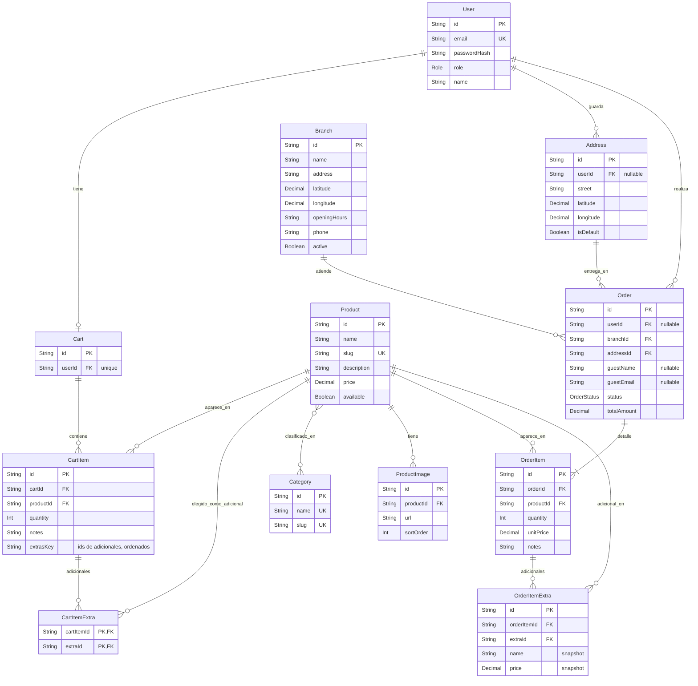

# Diagrama DER

**Proyecto:** Pedidos en casas de comidas rápidas  
**Versión:** 1.1  
**Actualizado:** 21/09/2026  
**Fuente:** `backend/prisma/schema.prisma`  
**Notación:** Crow’s Foot (modelo lógico)

Todas las entidades (salvo `ProductImage`, `OrderItem`, `CartItemExtra` y `OrderItemExtra`) incluyen `createdAt` y `updatedAt`. Esos campos no se repiten en cada caja para no saturar el diagrama.

## Cardinalidades

| Entidad A | Card. | Entidad B | Relación |
|---|---|---|---|
| User | 1 — 0..1 | Cart | Un usuario tiene a lo sumo un carrito |
| User | 1 — 0..N | Address | Direcciones del cliente; `userId` puede ser null (invitado) |
| User | 1 — 0..N | Order | Pedidos del cliente; `userId` opcional en checkout guest |
| Cart | 1 — 0..N | CartItem | Ítems del carrito; único por (`cartId`, `productId`, `extrasKey`) |
| Product | 1 — 0..N | CartItem | Un producto puede estar en muchos carritos |
| CartItem | 1 — 0..N | CartItemExtra | Adicionales elegidos en la línea; se borra en cascada con la línea |
| Product | 1 — 0..N | CartItemExtra | Producto usado como adicional; si se borra, sale de los carritos |
| Product | N — N | Category | Tabla implícita `_ProductCategories` |
| Product | 1 — 0..N | ProductImage | Galería; se borra en cascada con el producto |
| Branch | 1 — 0..N | Order | Sucursal que prepara el pedido |
| Address | 1 — 0..N | Order | Dirección de entrega del pedido |
| Order | 1 — 1..N | OrderItem | Detalle; se borra en cascada con el pedido |
| Product | 1 — 0..N | OrderItem | Snapshot de precio en `unitPrice` |
| OrderItem | 1 — 0..N | OrderItemExtra | Adicionales de la línea; se borra en cascada con el ítem |
| Product | 1 — 0..N | OrderItemExtra | Producto usado como adicional; no se puede borrar si tiene pedidos |

## Enums

**Role:** `customer`, `admin`

**OrderStatus:** `pending`, `confirmed`, `preparing`, `ready`, `on_the_way`, `delivered`, `cancelled`

## Notas

- **Product–Category** es N:N. Prisma no declara la tabla intermedia; en PostgreSQL queda `_ProductCategories`.
- **Checkout de invitado:** `Order.userId` y `Address.userId` son opcionales. El pedido guarda `guestName` y `guestEmail`. El carrito sigue siendo 1:1 con usuario logueado.
- **OrderItem.unitPrice** congela el precio al confirmar; no se recálcula si después cambia el producto.
- **Adicionales de hamburguesa (DEV-10):** un adicional es un `Product` de la categoría *Adicional* y se ofrece en los de *Hamburguesas*; la regla se resuelve por slug de categoría, sin tabla de configuración. `CartItem.extrasKey` (ids de adicionales ordenados, `""` si no hay) hace única la línea por producto + adicionales. `OrderItemExtra` congela nombre y precio, como `OrderItem.unitPrice`.

## Historial

| Versión | Fecha | Qué cambió |
|---|---|---|
| 1.1 | 21/09/2026 | Adicionales de hamburguesa (DEV-10): `CartItemExtra`, `OrderItemExtra` y `CartItem.extrasKey` |
| 1.0 | 07/09/2026 | DER inicial según `schema.prisma` (guest checkout, N:N Product–Category) |
